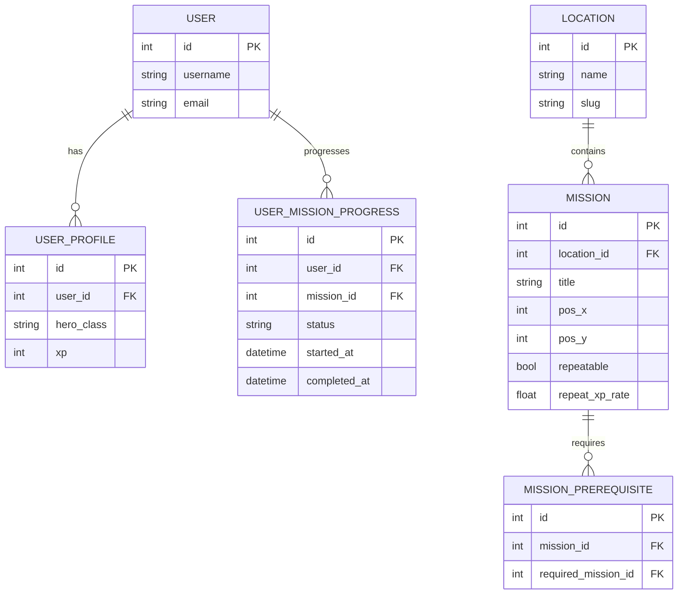
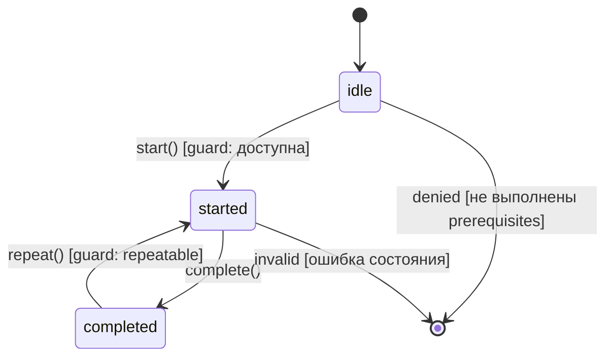

# Отчёт по exercises: RPG Learning Platform

Краткий отчёт подготовлен на основе дипломного проекта (Django + DRF + Next.js) и описывает цели, SDLC-стадии и модели предметной области. Итоговый файл сдачи — PDF. Для удобства приложены Markdown и HTML-версия с диаграммами Mermaid.

## Вводная

Проект — учебная платформа в жанре RPG, «как CodeCombat», где пользователь изучает программирование, проходя миссии на карте мира. Бэкенд на Django/DRF управляет контентом (локации, миссии, прогресс, классы персонажей, аутентификация), фронтенд на Next.js визуализирует карту и геймплей, а Postgres/Redis/Celery поддерживают хранилище и фоновые задачи.

## Глоссарий (коротко)

- Миссия — учебное задание с координатами на карте мира и правилами XP.
- Локация (мир) — набор миссий; визуальная область карты.
- Пререквизит — зависимость: миссию N можно начать только после завершения миссии M.
- XP — очки опыта, начисляемые за успешное прохождение миссий.
- Повторяемость — политика наград при повторном выполнении (коэффициент или 0).
- Статус прогресса — started/completed; хранится per user per mission.

## Цель

Сформировать наглядную, мотивирующую среду для обучения программированию:
- Карта «миров» и «миссий» с зависимостями и прогрессом.
- Чёткие учебные цели, XP/награды, повторяемость заданий.
- Трекинг прогресса и доступность миссий согласно prerequisites.

## SDLC (для данного проекта)

1. Инициация и сбор требований — референтный продукт (CodeCombat), пользовательские сценарии, роли.
2. Анализ и проектирование — ER/DFD, API-контракты (OpenAPI), координаты миссий, prerequisites, XP правила.
3. Реализация — Django/DRF (JWT, сериализаторы, /api), Next.js (карта, миссии), docker-compose.
4. Тестирование — unit/integration (pytest, pytest-django), smoke (/healthz), контрактные (Schemathesis — опционально).
5. Развёртывание — локально (docker, Makefile, deploy-local), CI jobs для сборки/смоук.
6. Сопровождение — демо-данные, документация (README, deploy), линтеры/формат.

Критерии готовности (Definition of Done) по инкременту:
- Все unit‑тесты зелёные; /healthz возвращает 200.
- Миссии отображаются на карте (pos_x/pos_y), статусы available/locked/complete корректны.
- Старт/завершение миссии изменяет прогресс и начисляет XP по правилам.

## Информационная модель (ER)

Диаграмма описывает ключевые сущности: Пользователь, Профиль, Локация (мир), Миссия, Прогресс пользователя по миссиям, зависимости между миссиями.



## Диаграмма потоков данных (DFD, уровень контурный)

Показывает основные процессы и обмен данными между фронтендом и бэкендом.

```mermaid
flowchart LR
  subgraph Frontend [Next.js UI]
    A[Auth/Login] --> B[Worlds List]
    B --> C[World Map]
    C --> D[Mission Detail]
  end

  subgraph Backend [Django + DRF]
    API[REST API /api]
  end

  A -- JWT creds --> API
  B -- GET /locations --> API
  C -- GET /locations/{id} (миссии с pos_x/pos_y, prerequisites) --> API
  D -- POST /missions/{id}/start --> API
  D -- POST /missions/{id}/complete --> API

  API -->|JWT tokens| A
  API -->|Локации, миссии| B
  API -->|Карта миссий (координаты, зависимости)| C
  API -->|Прогресс, XP| D
```

## Диаграмма состояний (прогресс миссии)



## Формальная модель (псевдокод)

Пример логики доступности миссии и расчёта XP за завершение:

```pseudo
function is_mission_available(user, mission):
  for req in mission.prerequisites:
    if not user.has_completed(req):
      return false
  return true

function start_mission(user, mission):
  if not is_mission_available(user, mission):
    raise AccessDenied
  user.progress[mission].status = "started"
  user.progress[mission].started_at = now()

function complete_mission(user, mission):
  if user.progress[mission].status != "started":
    raise InvalidState
  base_xp = mission.base_xp
  if user.has_completed(mission):
    if mission.repeatable:
      award = floor(base_xp * mission.repeat_xp_rate)
    else:
      award = 0
  else:
    award = base_xp
  user.profile.xp += award
  user.progress[mission].status = "completed"
  user.progress[mission].completed_at = now()
```

### Метрики успеха (примеры)
- Time‑to‑First‑Mission: < 3 минуты с регистрации.
- Доля пользователей, завершивших Intro → Gate: ≥ 60% на демо‑данных.
- Ошибки 5xx на API: < 0.1% за сессию демо.

## Как экспортировать в PDF

- Вариант 1 (HTML): откройте `docs/exercises_report.html` в браузере → Печать → Сохранить как PDF (на macOS: Command+P → PDF → Сохранить). Диаграммы Mermaid отрендерятся автоматически.
- Вариант 2 (MD): откройте `docs/exercises_report.md` в VS Code с расширением Markdown Preview Mermaid или в любом просмотрщике, поддерживающем Mermaid, затем экспортируйте в PDF.

---
Автор: Команда дипломного проекта. Дата: 27.10.2025.
